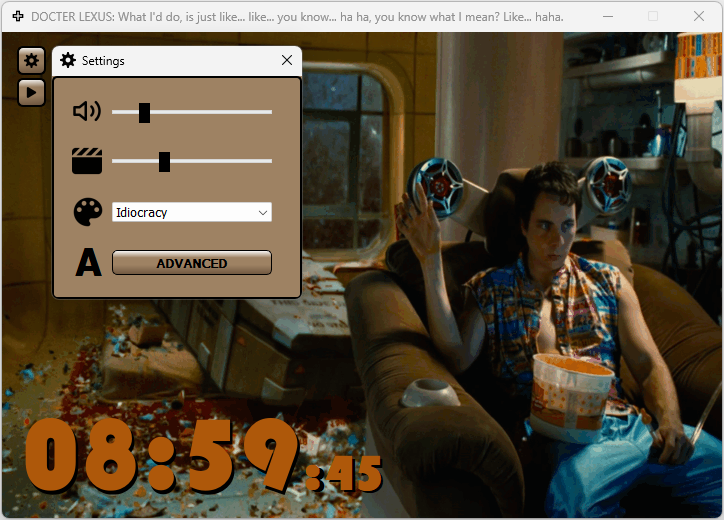
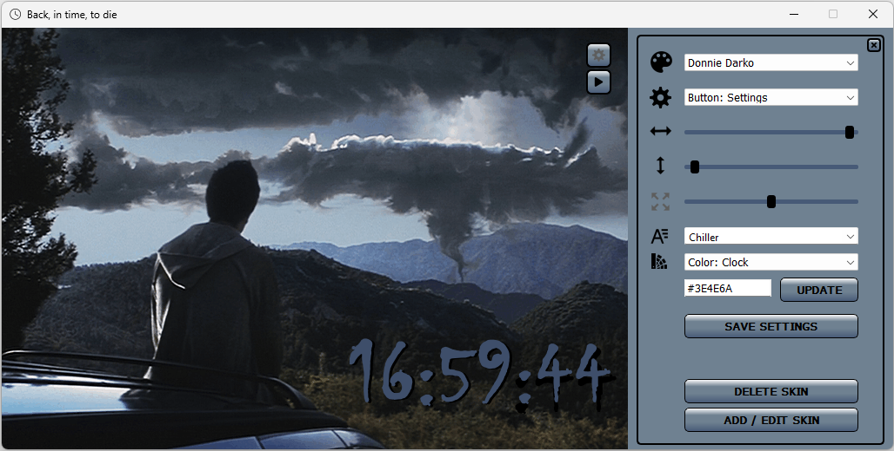
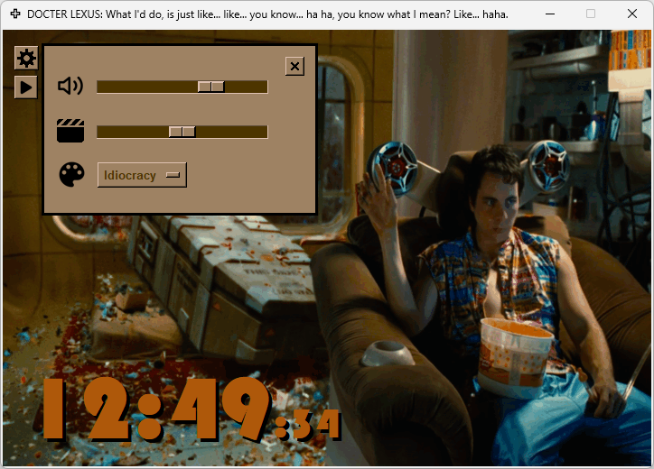
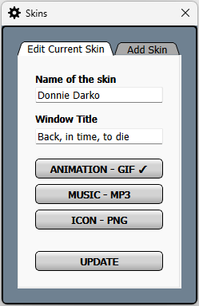

# Motion in Time
- `Motion in Time` displays the current time while animation and music are playing in the background
- Two versions are available:
    - The `PyQt6` version with `Advanced Settings` options as described below
    - The original version created with `Tkinter`, without additional features
- Launching `Motion in Time` from the `Taskbar`:
    - With only one click you can enjoy the current time from your bed according to your mood


## PyQt6:


https://github.com/K4KarolE/Motion_In_Time/assets/89346643/7590ee11-ad88-4655-b06e-1c2431961f8d


https://github.com/K4KarolE/Motion_In_Time/assets/89346643/b22ae5fe-a1cf-4658-b2c0-98ab8b436fdb


<div align="left">
    
</div>
<br>
<div align="left">
    
</div>


## Tkinter:
<div align="left">
    
</div>
<br>

## Guide:
### Welcome Screen
- App opens with the latest:
    - Skin
    - Music volume
    - Animation speed
- Play/Stop toggle button action:
    - Starts, stops the music
    - Value saved automatically
- Settings button: launches the `Settings` pop-up window

### Settings window
- Using the related sliders, able to change:
    - Music Volume
    - Animation speed
    - Both values are automatically saved
- Roll-down menu:
    - Able to switch between skins, currently available:
        - Back to the Future I.
        - Donnie Darko
        - Idiocracy
        - Interstellar
        - Terminator I.
    - After the new selection, app restarts with the selected skin
- Clicking on the Advanced button:
    - Closes the `Settings window`
    - Opens the `Advanced settings` options on the right side of the main window

### Advanced settings "window"
- Roll-down menu (first):
    - Able to switch between skins
    - After the new selection, app restarts with the selected skin + visible `Advanced settings`
- Roll-down menu (second):
    - Able to select the widget to use
    - Once it is selected, it automatically updates the sliders to the selected widget's current position and size(timers only)
    - Able to change the positions:
        - Home screen buttons (Play, Settings):
        - Settings window (displayed with disabled functionalities)
        - Main window (the top slider moved/displayed in a pop-up window for the horizontal adjustment)
        - Timer: `Hours:Minutes` and `:Seconds` separately
        - Timer's shadow: `Hours:Minutes` and `:Seconds` separately
    - If after a display change the previously selected app position would be outside the current displayed size:
        - App opens at the half of the screen (the app`s left-top corner in the middle)
    - Abe to change the size of all Timer instance separately
- Able to change the colour of the:
    - Timer (shadow remains black)
    - Windows, buttons (same value)
    - Buttons pressed
        -	Which equals to the colour of the unpressed buttons’ bottom part (contributing the buttons 3D effect)
- Able to change the Timers font style together
- Save settings button: after the confirmation able to save all the update actioned on the current skin
</img>
- Delete skin button (if more than one skin is available):
    - After the confirmation* able to delete the current skin
    - *The skin's title and folder path are displayed in the pop-up window
    - App automatically restarts, with the first skin in the list (+ confirmation message)
- Add / Edit skin button:
    - Launches a new window with two tabs:
    - Edit Current Skin:
        - Name: field can not be empty
        - Window Title: not mandatory
        - Files: no mandatory change needed
            - If new file selected, checkmark is displayed at the end of the title
    - Add Skin:
        - Apart from the Window Title, all options are mandatory


## GIF image creation and how it is used in the animation
- The GIF images are generated in `DaVinci Resolve`:
    - On the Deliver page:
        - Format: GIF
        - Codec: Animated GIF
        - Resolution: 720 x 486 NTSC
- `PyQt6`:
    - The GIF/animation playback is handled by `PyQt's` own `QMovie` module
- `Tkinter`:
    - Image objects are created from the GIF via DIY in the app
    - The returning phase of the movements in the animation are not part of the GIF images
    - It is coming from allocating the same image object for 2 mirrored positions in the image sequence/list:
        - half sized GIF images, faster load time

- The current GIF images are tailored for the faster `PyQt` version

## Requirements
### Python 3 - used: 3.11.5
- https://www.python.org/

### Install dependencies
## PyQt6
``` pip install -r requirements_pyqt.txt ```
## Tkinter
``` pip install -r requirements_tkinter.txt ```

### OS
- Tested on Windows 11

## Thank you all who worked on the modules used in this project!
