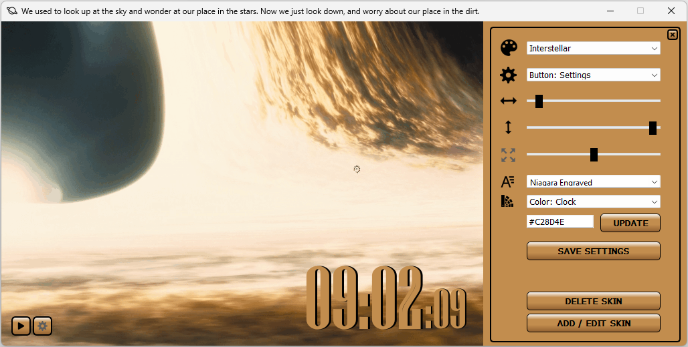

# Motion in Time
- `Motion in Time` displays the current time while animation and music are playing in the background
- Can be updated in the app:
    - Music On/Off
    - Music volume
    - Animation speed
    - Switch between skins
    - Via `Advanced Settings`:
        - Times`:
            - Position
            - Size
            - Color
            - Style
        - Settings and Play/Stop buttons`:
            - Position
            - Color*
        - Main and Settings windows`
            - Position on the screen at the app start
            - Color (* same)
    - Skins, currently available:
        - Back to the Future I.
        - Donnie Darko
        - Idiocracy
        - Interstellar
        - Terminator I.
- GUI+:
    - Two versions are available:
        - The `PyQt` version with additional features as previously described
        - The original version created with `Tkinter`, without the `Advanced Settings` options
- Launching `Motion in Time` from the `Taskbar`: 
    - With only one click you can enjoy the current time from your bed according to your mood

## PyQt6:
<div align="left">
    
</div>
<br>
<div align="left">
    
</div>


## Tkinter:
<div align="left">
    
</div>


### GIF image creation and how it is used in the animation
- The GIF images are generated in `DaVinci Resolve`:
    - On the Deliver page:
        - Format: GIF
        - Codec Animated GIF
        - Resolution: Custom - 720 x 486
- `PyQt6`:
    - The GIF/animation playback is handled by PyQt's own `QMovie` module
    - No additional steps required
- `Tkinter`:
    - Image objects are created from the GIF via DIY
    - The returning phase of the movements in the animation are not part of the GIF images
    - It is coming from allocating the same image object for 2 mirrored positions in the image sequence/list:
        - half sized GIF images, faster load time

- The current GIF images are tailored for the faster `PyQt` version

## Requirements
### Python 3 - used: 3.11.6
- https://www.python.org/

### Install dependencies
## PyQt6
``` pip install -r requirements_pyqt.txt ```
## Tkinter
``` pip install -r requirements_tkinter.txt ```

### OS
- Tested on Windows 11

## Thank you all who worked on the modules used in this project!