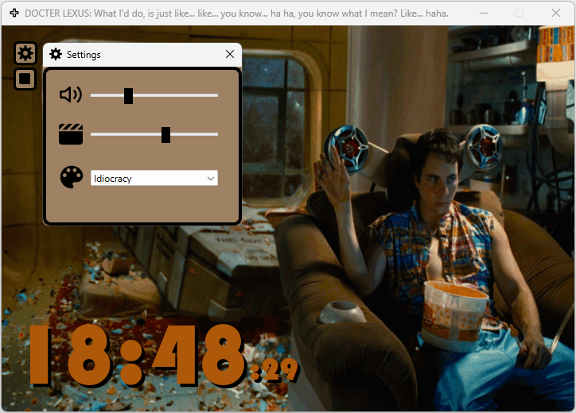
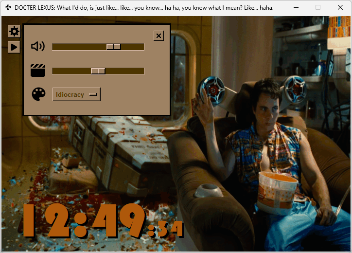

# Motion in Time
- `Motion in Time` displays the current time while the selected-skin related animation and music are playing in the background
- Can be updated in the app:
    - Music On/Off
    - Music volume
    - Animation frequency
    - Skins, currently available:
        - Back to the Future I.
        - Donnie Darko
        - Idiocracy
        - Terminator I.
- GUI+:
    - The `PyQt` version with additional features is in progress
    - The original created with `Tkinter`, music played with `Pygame`, images created with `Pillow`

## PyQt6:
<div align="left">
    
</div>

## Tkinter:
<div align="left">
    
</div>


### Tkinter: GIF image creation and how it is used in the animation
- The GIF images are generated in `DaVinci Resolve`:
    - On the Deliver page:
        - Format: GIF
        - Codec Animated GIF
        - Resolution: Custom - 720 x 518
- The returning phase of the movements in the animation are not part of the GIF images
- It is coming from allocating the same image object (pulled from the GIF) for 2 mirrored positions in image sequence/list:
    - half sized GIF images, faster load time

## Requirements
### Python 3 - used: 3.11.6
- https://www.python.org/

### Install dependencies
## PyQt6
``` work in progress ```
## Tkinter
``` pip install -r requirements_tkinter.txt ```

### OS
- Tested on Windows 11

## Thank you all who worked on the modules used in this project!