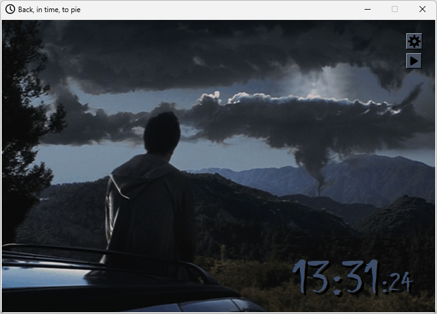
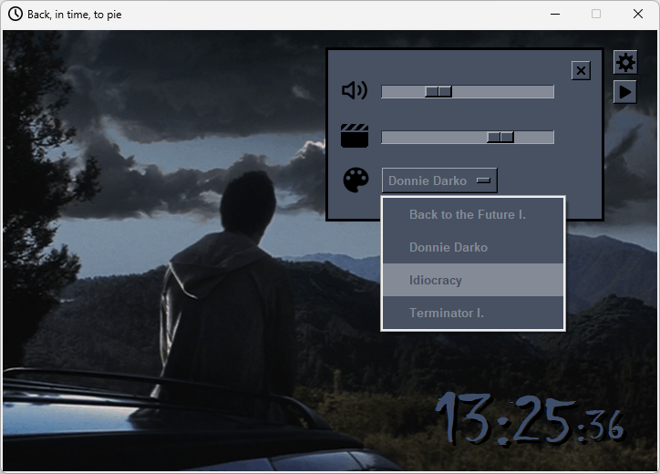

# Motion in Time
- `Motion in Time` displays the current time while the selected-skin related animation and music are playing in the background
- Can be updated in the app:
    - Music On/Off
    - Music volume
    - Animation frequency
    - Skins, currently available:
        - Back to the Future I.
        - Donnie Darko
        - Idiocracy
        - Terminator I.


https://github.com/K4KarolE/Motion_In_Time/assets/89346643/b7e8592c-8829-4c87-94f9-6305eab71d49


<div align="center">
    
</div>
<br>
<div align="center">
    
</div>
<br>

## Requirements
### Python 3 - used: 3.11.6
- https://www.python.org/

### Install packages\dependencies
```
pip install -r requirements.txt
```
### OS
- Tested on Windows 11

## Thank you all who worked on the modules used in this project!
