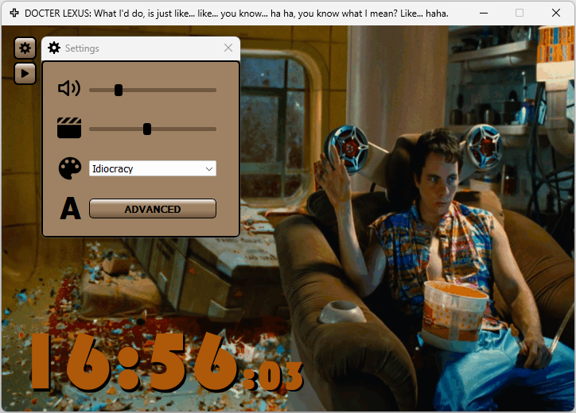

# Motion in Time
- `Motion in Time` displays the current time while animation and music are playing in the background
- Two versions are available:
    - The `PyQt` version with `Advanced Settings` options as described below
    - The original version created with `Tkinter`, without additional features
- Launching `Motion in Time` from the `Taskbar`:
    - With only one click you can enjoy the current time from your bed according to your mood


## PyQt6:


https://github.com/K4KarolE/Motion_In_Time/assets/89346643/7590ee11-ad88-4655-b06e-1c2431961f8d


https://github.com/K4KarolE/Motion_In_Time/assets/89346643/b22ae5fe-a1cf-4658-b2c0-98ab8b436fdb


<div align="left">
    
</div>


## Tkinter:
<div align="left">
    
</div>
<br>

## Can be updated via UI:
- Music On/Off
- Music volume
- Animation speed
- Switch between skins, currently available:
    - Back to the Future I.
    - Donnie Darko
    - Idiocracy
    - Interstellar
    - Terminator I.
- Via `Advanced Settings`:
</img>
    - Times`:
        - Position
        - Size
        - Color
        - Style
    - Settings and Play/Stop buttons` position and color*
    - Main and Settings windows`
        - Position on the screen at startup
        - Color (* same)
    - Edit the current skin`s
        - Name
        - Title (displayed in the main window)
        - Files (gif, mp3, png)
    - Add new skin
    - Delete the current skin
    

## GIF image creation and how it is used in the animation
- The GIF images are generated in `DaVinci Resolve`:
    - On the Deliver page:
        - Format: GIF
        - Codec: Animated GIF
        - Resolution: 720 x 486 NTSC
- `PyQt6`:
    - The GIF/animation playback is handled by `PyQt's` own `QMovie` module
- `Tkinter`:
    - Image objects are created from the GIF via DIY in the app
    - The returning phase of the movements in the animation are not part of the GIF images
    - It is coming from allocating the same image object for 2 mirrored positions in the image sequence/list:
        - half sized GIF images, faster load time

- The current GIF images are tailored for the faster `PyQt` version

## Requirements
### Python 3 - used: 3.11.6
- https://www.python.org/

### Install dependencies
## PyQt6
``` pip install -r requirements_pyqt.txt ```
## Tkinter
``` pip install -r requirements_tkinter.txt ```

### OS
- Tested on Windows 11

## Thank you all who worked on the modules used in this project!
